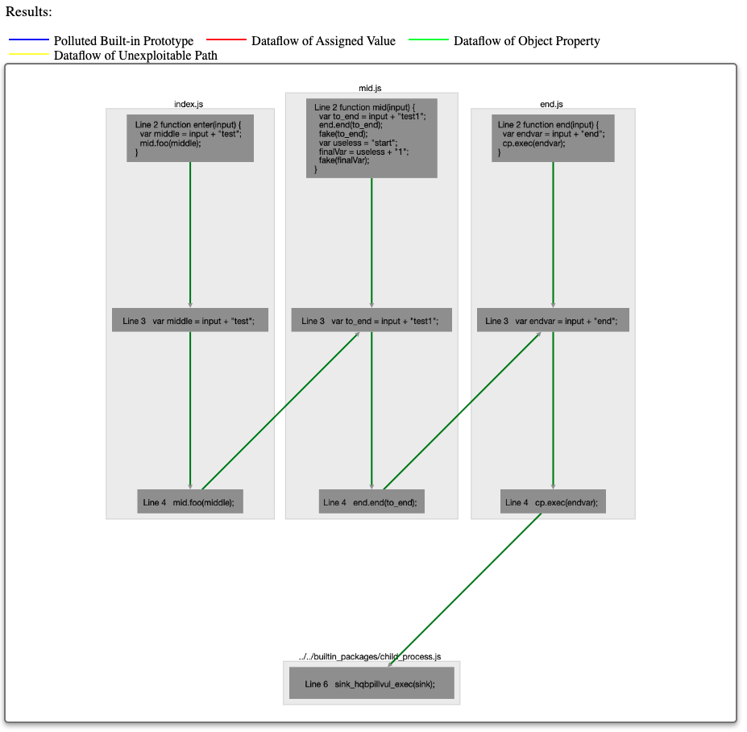
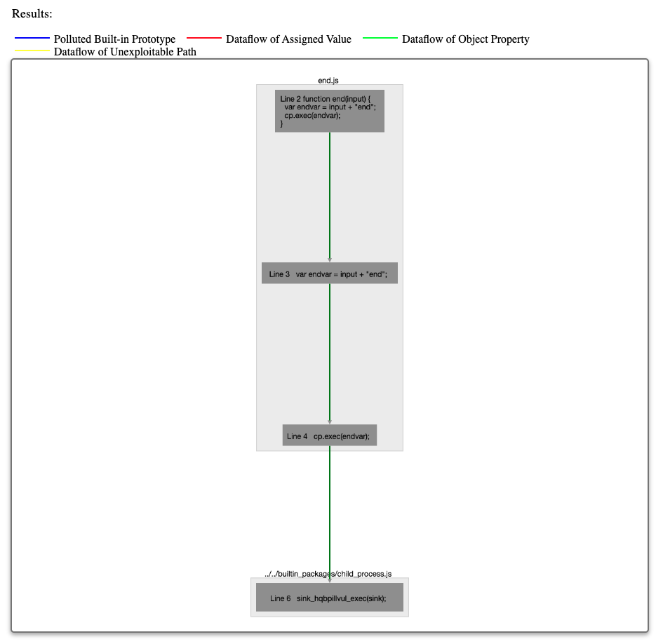
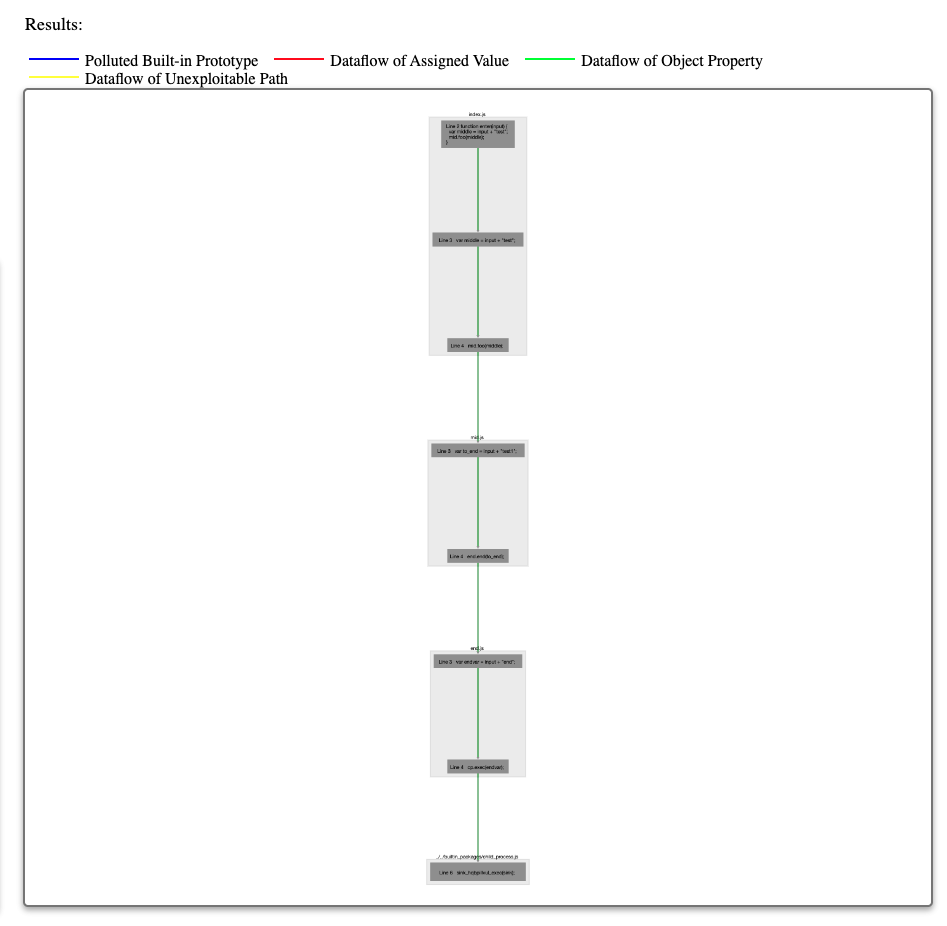
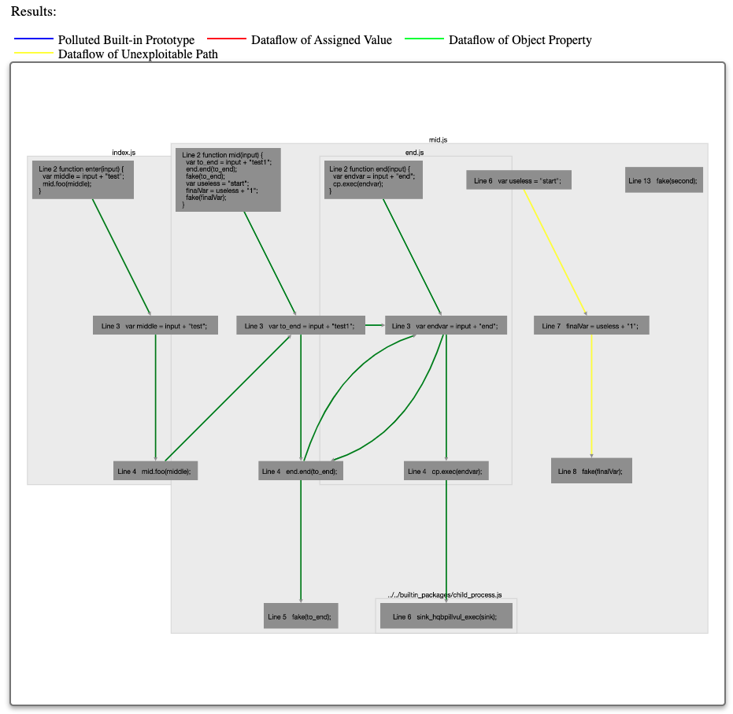
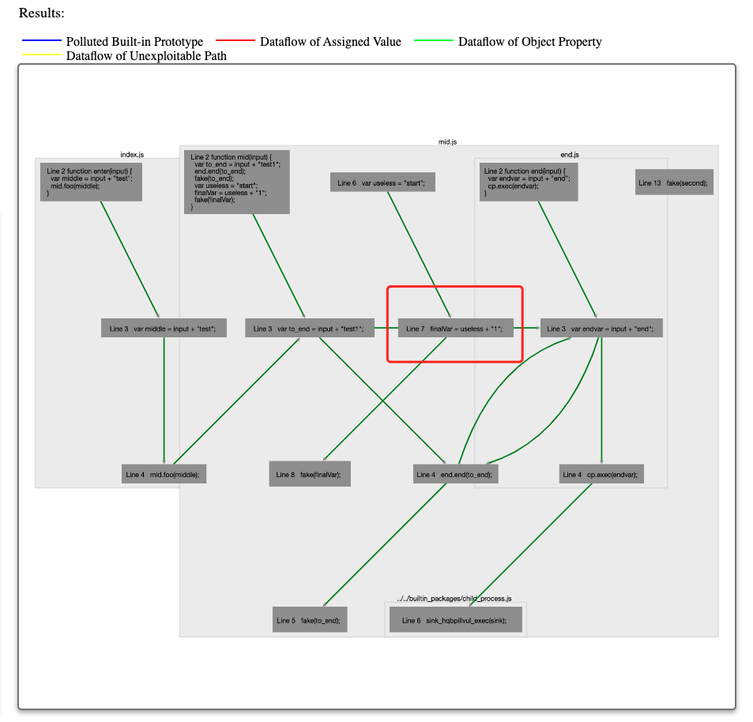
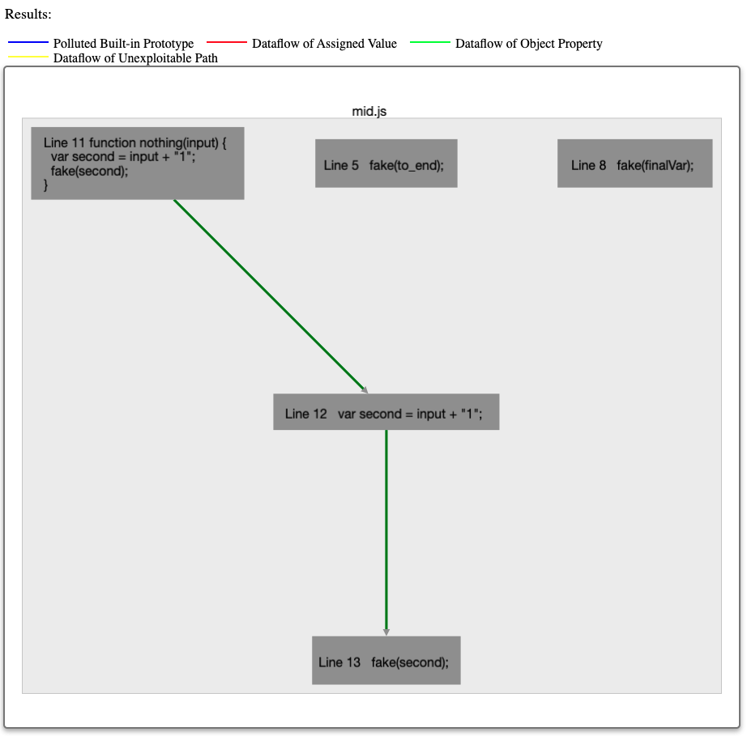

# Demo description

In this demo, we will show the following functions:

- The detection of Command Injection
- The Exit when detected function
- The End to End Only function
- Set sink function
- Mark tainted
- Set entrance function

### The detection of Command Injection
- 1. Click <kbd>Choose zip file to upload</kbd> to pick the zip file of the package. Here we use the `multi_command.zip` file
- 2. Click the <kbd>Upload</kbd> button until a green icon appears, which means the zip file is successfully uploaded
- 3. Select the type of vulnerability. Here we select the `Command Injection`
- 4. Select the options. Now, let's uncheck the `Exit When Detected` box
- 5. Click the  <kbd>Start</kbd> button and wait for the progress bar to finish
- 6. Once the Results are ready, you should be able to see them in the right part of the webpage in the form of a graph. You can click the components of the graph. We will grep the related source code from the server for you to check.

### The Exit when detected function (Optional)
Sometimes when the package is very large, we want to exit the tool once we find a vulneralbility. In this case, we can check the `Exit When Detected` checkbox and click the <kbd>Start</kbd> buttion again. This time you will see we exit the process after we detect the first path

### The End to End Only function
- 1, Let's uncheck the `Exit When Detected` checkbox again
- 2, Check the `End to End Only` checkbox
- 3, Click the <kbd>Start</kbd> buttion

You will see there is a path all the way from the `index.js` to the final sink function without considering the exported function of `mid.js` and `end.js` as the starting points. 

### Set sink function

- 1, Uncheck the `End to End Only` checkbox
- 2, Click the <kbd>Start</kbd> buttion to see the original result
- 3, Click the `mid.js` file (or you can click any box in the `mid.js` box of the result box) to show the `mid.js` file
- 4, At line 8, double click the `fake` function name to select the `fake` call, right click the selected `fake` and select `set as sink function` from the pop-up options
- 5, Click the <kbd>Start</kbd> buttion

Now you should be able to see the new edges to the `fake(to_end)` call. At the same time, you should be table to see the yellow unexploitable path (which means there is a path to the sink function but the var is not tainted) 

### Mark tainted

- 1, At line 7, double click the `finalVar` to select the `finalVar` text. Right click the selected text and choose `mark tainted`
- 2, Click the <kbd>Start</kbd> buttion to see the result

This time you will see the yellow edges turns to green since the `finalVar` is marked as tainted. The path is exploitable.

The result should be like this:

Note that here I use a red box to circle out the `finalVar` assignment. If you drag the circled box around you will find the box is not connected with the edge from left to right. Compared with the prevoius result, this version just change the colors of the edges from yellow to green. 

### Set entrance function

- 1, At line 11, double click the `nothing` function name to select the `nothing` text. Right click the selected text and chosse `set as entrance`
- 2, Click the <kbd>Start</kbd> buttion

This time since `nothing` is set as the entrance function, you should only be able to see one path from nothing to fake. 
